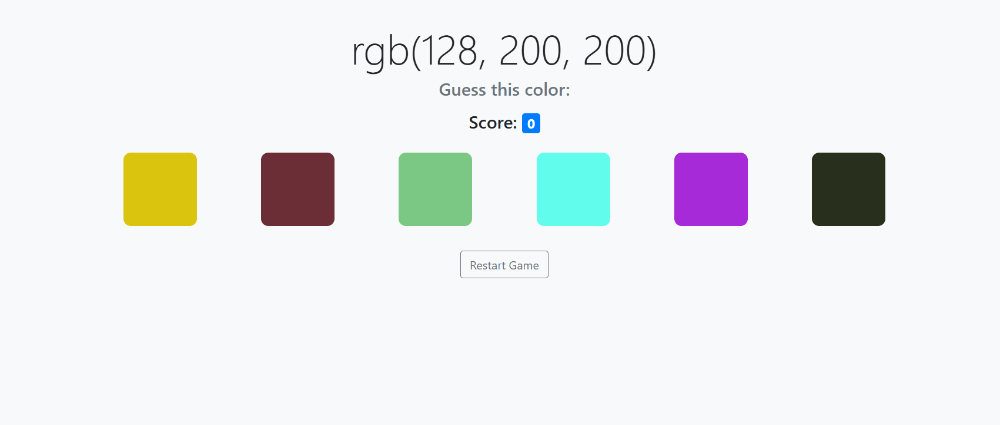

# Guess The Color



**Guess The Color** is a simple and fun web-based game where the user is challenged to guess the correct color based on its RGB value. The game is designed to be both educational and entertaining, providing a unique way to learn about RGB color codes.

## Table of Contents

- [About the Project](#about-the-project)
- [Getting Started](#getting-started)
- [How to Play](#how-to-play)
- [Built With](#built-with)
- [Features](#features)
- [Contributing](#contributing)
- [License](#license)
- [Contact](#contact)

## About the Project

"Guess The Color" is designed to improve the player's ability to recognize and distinguish between different colors based on their RGB (Red, Green, Blue) values. The game randomly generates colors, and the player has to choose the correct one from a set of options.

## Getting Started

### Prerequisites

To run this project, you need a modern web browser. No additional software is required.

### Installation

1. Clone the repository:
    ```bash
    git clone https://github.com/piyanka/Guess-The-Color.git
    ```
2. Navigate to the project directory:
    ```bash
    cd guess-the-color
    ```
3. Open the `index.html` file in your preferred web browser:
    ```bash
    open index.html
    ```

## How to Play

1. The game will display an RGB color code.
2. You must guess which of the six color options corresponds to the displayed RGB code.
3. Click on the color you believe matches the RGB code.
4. If you guess correctly, your score increases. If not, your score resets to zero.
5. You can restart the game at any time by clicking the "Restart Game" button.

## Built With

- **HTML** - For structuring the content.
- **CSS** - For styling the UI.
- **JavaScript** - For the game logic.
- **Bootstrap** - For responsive design and UI components.

## Features

- Random RGB color generation.
- Score tracking using local storage.
- Responsive design, compatible with both desktop and mobile browsers.
- Interactive UI with hover effects and visual feedback.

## Contributing

Contributions are welcome! Please fork this repository and submit a pull request if you have any improvements or suggestions.

## License

This project is licensed under the MIT License. See the [LICENSE](LICENSE) file for more details.

## Contact

If you have any questions or feedback, feel free to reach out to me:

- **GitHub**: [piyanka](https://github.com/piyanka)
- **Email**: yadavpriyanka97181019@example.com
